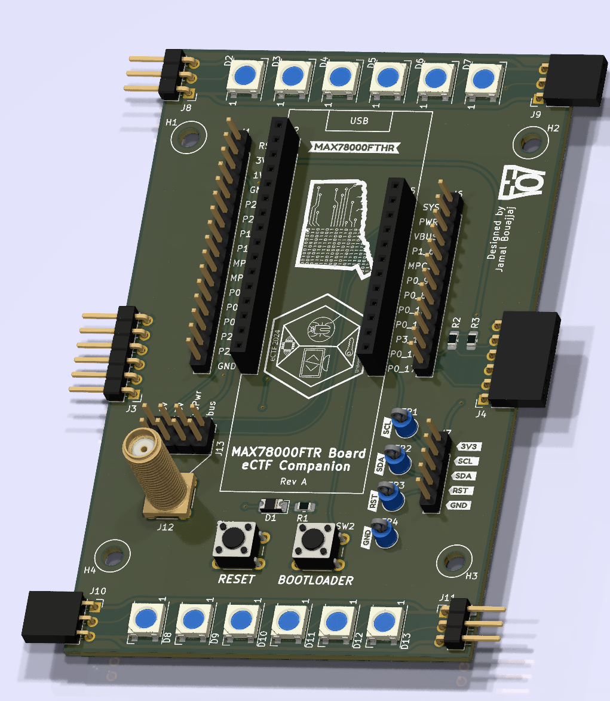

# UNewHaven 2024 eCTF
### Rev A

This is a daughterboard for the MAX78000FT development board, designed for the 2024 eCTF competition.

This was partially inspired by MITRE's own board design, and from a joke gone too far (the leds are what started it all).

# Features
- As the competition has 3 interconnected boards, this design provisions for side-interconnects
- Independent and chain-able WS2812B LEDs on the top of the board, for some true ectf gaming
- Expandable IO for MAX78000FT board
- SMA monitoring for a selection of voltage lines

# License
This project is licensed under GPLv3.
